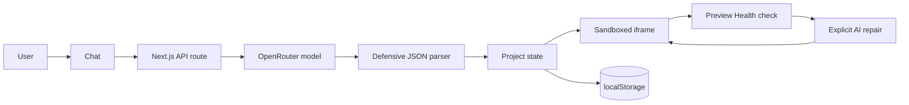

# Forge AI

> Describe it. Build it. Refine it.

Forge AI is a focused AI web app builder. Describe a product in natural language, follow the build as it happens, preview a working application, and refine it in the same conversation.

## Demo

- **Live application:** [https://forge-ai.fuhaojun.com](https://forge-ai.fuhaojun.com)
- **Source code:** [https://github.com/fhj414/forge-ai](https://github.com/fhj414/forge-ai)
- **Challenge write-up:** [SUBMISSION.md](./SUBMISSION.md)

For the fastest evaluation path, open the live application, choose an example, generate it, interact with the preview, edit a source tab, apply the change, and inspect Version History. The complete Preview Health repair path is documented in the challenge write-up.

The public demo can be evaluated without signing in. `Local autosave` persists Forge projects, source, messages, metadata, and revisions in the current browser; it does not claim that temporary data created inside a generated preview survives a page refresh.

## What it does

```text
Generate → Validate → Preview → Check → Repair → Re-check
```

1. A user describes an app or selects a starting example.
2. Forge sends the request to OpenRouter through a server-only API route.
3. A real request-linked execution timeline communicates progress.
4. The response is cleaned, parsed, and validated before it reaches the UI.
5. HTML, CSS, and JavaScript render in an isolated live preview, which automatically reports render facts and bounded runtime failures.
6. When Preview Health reports a concrete issue, the user can explicitly choose `Ask AI to fix`; repairs are never automatic.
7. Users can edit any generated source file, apply it to the preview, or discard the draft.
8. Follow-up prompts include the current source so the model edits instead of restarting.
9. Projects, source, suggestions, and conversation history persist in the browser.
10. Every generated build records trusted model, timing, source-size, and validation metadata.
11. The Preview toolbar downloads the active project as a standalone runnable HTML application, not a full project backup.

## Features

- Provider-neutral AI generation through `AI_API_BASE` and `AI_MODEL`
- Real Agent execution timeline instead of a generic spinner
- Sandboxed live preview with desktop, tablet, and mobile viewports
- Automatic Preview Health checks for rendered content, control/form counts, uncaught errors, and unhandled promise rejections
- Explicit one-click AI repair using bounded diagnostics; no automatic repair loop or automatic model spend
- Built-in form and native canvas chart compatibility for generated apps
- Editable HTML, CSS, and JavaScript with Apply, Discard, copy, dirty state, and `Cmd/Ctrl + S`
- Iterative editing that sends the current source back to the model
- Local-first project persistence and history restore/delete
- Capped version history with one-click restore and revision source labels
- Trusted generation metadata for model, duration, source size, and schema validation
- Standalone runnable `Download HTML` export with embedded preview compatibility runtime (not a restorable project backup)
- Visible persistence failure feedback when browser storage is unavailable
- Suggested improvements that become one-click refinement prompts
- Deterministic AI Build Summary based on generated structure and controls
- Explicit empty, generating, success, error, retry, invalid-output, timeout, and missing-key states
- Responsive, accessible dark developer-tool interface

## Tech stack

- Next.js App Router, React, and strict TypeScript
- Tailwind CSS build pipeline with product-specific global tokens and CSS
- Zod for request and model-output validation
- Lucide React icons
- Browser `localStorage` through a replaceable storage adapter
- Vitest and Testing Library

## Architecture



The client never receives the AI key. `/api/generate` adds the dedicated system prompt, applies one shared 55-second request budget, retries one transient provider or network failure only within that budget, strips Markdown fences, extracts JSON, and validates every field before returning a result. A timeout is returned immediately instead of starting another full model request.

## Key engineering decisions

### 1. HTML/CSS/JS instead of full React generation

For a 6–8 hour product challenge, reliability is more valuable than runtime complexity. A full npm sandbox introduces dependency resolution, bundling, version compatibility, and long cold-start failure modes. A constrained HTML/CSS/native-JavaScript contract is fast, portable, and considerably easier for a model to satisfy consistently.

This is an intentional product decision, not a missing abstraction. The closed loop—generation, execution, preview, persistence, and iterative editing—works without a container or client-side compiler.

### 2. Sandboxed iframe execution

Generated JavaScript runs in an iframe with only:

```html
sandbox="allow-scripts allow-forms"
```

The actual policy is `allow-scripts allow-forms`: form events are enabled so generated submit handlers can run, while a capture listener prevents navigation and CSP keeps `form-action 'none'`. `allow-same-origin` is deliberately absent. Closing `script` and `style` tags are neutralized while composing `srcDoc`, and the restrictive content security policy blocks network connections, form submissions, remote assets, and access to the parent application. Isolated in-memory storage and canvas-chart compatibility layers keep common generated interactions working without external packages.

### 3. Local-first persistence

Projects use `forge-ai-projects`; the selected project uses `forge-ai-current-project`. The storage functions are isolated from React so a future Supabase or PostgreSQL adapter can replace localStorage without changing generation or preview logic.

Generated applications have a separate state boundary. Their Storage compatibility layer is intentionally in-memory inside the isolated preview, so runtime data created by a generated app is not part of Forge's persisted project record and is not guaranteed to survive a refresh.

### 4. Provider abstraction

The backend uses OpenRouter's standard chat-completions HTTP contract instead of a provider SDK. The API base, key, and model remain runtime configuration, so models can be changed without exposing secrets to the browser.

### 5. Preserve the last valid build

Network and model errors are represented as recoverable UI state. A failed refinement does not clear or mutate the current project; Retry resubmits the same prompt against the same source.

### 6. Preview Health and explicit AI repair

Each active preview runs a non-invasive health check after it renders. It reports whether meaningful content rendered, counts controls and forms, and captures bounded uncaught JavaScript errors and unhandled promise rejections from the sandboxed preview. It does not click controls, submit forms, judge visual quality, inspect application state, or verify business logic.

Repair is always an explicit `Ask AI to fix` action, enabled only when a concrete issue is present. The existing generation path receives the current source plus normalized, size-bounded diagnostics. Forge does not retry a repair from a health result, so there is no automatic spend or repair loop. A failed provider, network, timeout, or schema response preserves the current preview and its revision history.

Before a successful repair replaces source, the current artifact is snapshotted. Version History exposes that prior artifact and labels the new current source as `AI auto-fix`; the fresh preview then runs another health check.

### 7. Delivery confidence

Each successful build stores the configured model, measured request duration, source line and byte counts, and a
`schemaValidated: true` marker. The active project keeps the ten most recent prior revisions, including manual edits
and restores, while conversation messages remain an audit trail. `Download HTML` is a runnable artifact rather than a
full project backup; it reuses the exact document composer
used by the sandboxed preview, so forms, browser storage compatibility, native Chart-style rendering, and CSP remain
available in the one-file export. API keys and server-only environment variables never enter projects, revisions, or
downloads.

Preview Health does not weaken the boundary: generated source still runs in an iframe with
`sandbox="allow-scripts allow-forms"`, without `allow-same-origin`. The existing restrictive CSP is unchanged;
diagnostic messages are accepted only from the active iframe and require its per-render opaque session identifier.

## Local development

Requirements: Node.js 22.13 or newer and npm. An `.nvmrc` is included for NVM users.

```bash
npm install
cp .env.example .env.local
npm run dev
```

Open [http://localhost:3000](http://localhost:3000).

Configure OpenRouter in `.env.local` (the default model favors fast code generation):

```env
AI_API_KEY=your_api_key_here
AI_API_BASE=https://openrouter.ai/api/v1
AI_MODEL=qwen/qwen3.5-35b-a3b:nitro
```

When any required value is missing, the UI shows `AI service is not configured.` and offers Retry; it does not expose a server stack trace.

## Quality checks

```bash
npm test
npm run lint
npm run build
```

## Deploy to Vercel

1. Import this repository into Vercel.
2. Keep the detected framework preset as Next.js.
3. Add `AI_API_KEY`, `AI_API_BASE`, and `AI_MODEL` in Project Settings → Environment Variables.
4. Deploy. The App Router API route runs as a serverless function; no separate backend service is required.

## Project structure

```text
app/
  api/generate/route.ts       Server-only AI endpoint
components/                  Focused workspace UI
hooks/                       Generator and project state
lib/                         AI, parser, preview, storage, and summary logic
prompts/app-builder.ts       Standalone model contract
types/                       Shared strict TypeScript models
```

## Current limitations

- Projects are device-local and do not sync between browsers.
- Generated applications are single-document HTML/CSS/JavaScript projects.
- Generation is request/response rather than token streaming.
- There is no visual editor or generated-app deployment flow.
- Preview applications cannot install packages or call arbitrary external APIs.

## Future work

### P0

- Streaming generation and step events
- Stronger static validation for generated JavaScript and unsafe HTML

### P1

- Multi-file React generation with Sandpack or WebContainer
- Authenticated database persistence and cross-device sync
- Import/export project backups containing source, messages, metadata, and revision history

### P2

- Specialized multi-agent build roles
- GitHub synchronization
- One-click deployment for generated applications
- Visual selection and direct manipulation
