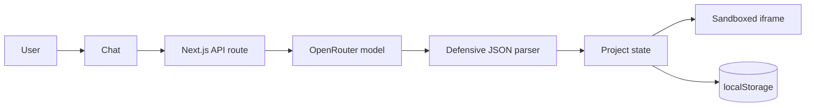

# Forge AI

> Describe it. Build it. Refine it.

Forge AI is a focused AI web app builder. Describe a product in natural language, follow the build as it happens, preview a working application, and refine it in the same conversation.

## Demo

The application is ready for a one-click Vercel deployment. Add the production URL here after connecting the repository and configuring the three server-side AI variables below.

## What it does

```text
Prompt → Agent execution → Validated code → Sandboxed preview → Local project → Refine
```

1. A user describes an app or selects a starting example.
2. Forge sends the request to OpenRouter through a server-only API route.
3. A real request-linked execution timeline communicates progress.
4. The response is cleaned, parsed, and validated before it reaches the UI.
5. HTML, CSS, and JavaScript render in an isolated live preview.
6. Follow-up prompts include the current source so the model edits instead of restarting.
7. Projects, source, suggestions, and conversation history persist in the browser.

## Features

- Provider-neutral AI generation through `AI_API_BASE` and `AI_MODEL`
- Real Agent execution timeline instead of a generic spinner
- Sandboxed live preview with desktop, tablet, and mobile viewports
- HTML, CSS, and JavaScript source viewer with copy support
- Iterative editing that sends the current source back to the model
- Local-first project persistence and history restore/delete
- Visible persistence failure feedback when browser storage is unavailable
- Suggested improvements that become one-click refinement prompts
- Deterministic AI Build Summary based on generated structure and controls
- Explicit empty, generating, success, error, retry, invalid-output, timeout, and missing-key states
- Responsive, accessible dark developer-tool interface

## Tech stack

- Next.js App Router, React, and strict TypeScript
- Tailwind CSS build pipeline with product-specific global tokens and CSS
- Zod for request and model-output validation
- Lucide React icons
- Browser `localStorage` through a replaceable storage adapter
- Vitest and Testing Library

## Architecture



The client never receives the AI key. `/api/generate` adds the dedicated system prompt, applies a 45-second timeout, retries one transient failure, strips Markdown fences, extracts JSON, and validates every field before returning a result.

## Key engineering decisions

### 1. HTML/CSS/JS instead of full React generation

For a 6–8 hour product challenge, reliability is more valuable than runtime complexity. A full npm sandbox introduces dependency resolution, bundling, version compatibility, and long cold-start failure modes. A constrained HTML/CSS/native-JavaScript contract is fast, portable, and considerably easier for a model to satisfy consistently.

This is an intentional product decision, not a missing abstraction. The closed loop—generation, execution, preview, persistence, and iterative editing—works without a container or client-side compiler.

### 2. Sandboxed iframe execution

Generated JavaScript runs in an iframe with only:

```html
sandbox="allow-scripts"
```

`allow-same-origin` is deliberately absent. Closing `script` and `style` tags are neutralized while composing `srcDoc`, and a restrictive content security policy blocks network connections, form submissions, remote assets, and access to the parent application. An isolated in-memory `localStorage`/`sessionStorage` compatibility layer prevents generated apps from losing all interactions when browser storage is unavailable in the sandbox.

### 3. Local-first persistence

Projects use `forge-ai-projects`; the selected project uses `forge-ai-current-project`. The storage functions are isolated from React so a future Supabase or PostgreSQL adapter can replace localStorage without changing generation or preview logic.

### 4. Provider abstraction

The backend uses OpenRouter's standard chat-completions HTTP contract instead of a provider SDK. The API base, key, and model remain runtime configuration, so models can be changed without exposing secrets to the browser.

### 5. Preserve the last valid build

Network and model errors are represented as recoverable UI state. A failed refinement does not clear or mutate the current project; Retry resubmits the same prompt against the same source.

## Local development

Requirements: Node.js 22.13 or newer and npm. An `.nvmrc` is included for NVM users.

```bash
npm install
cp .env.example .env.local
npm run dev
```

Open [http://localhost:3000](http://localhost:3000).

Configure OpenRouter in `.env.local` (the default model favors fast code generation):

```env
AI_API_KEY=your_api_key_here
AI_API_BASE=https://openrouter.ai/api/v1
AI_MODEL=z-ai/glm-5.3-flashx
```

When any required value is missing, the UI shows `AI service is not configured.` and offers Retry; it does not expose a server stack trace.

## Quality checks

```bash
npm test
npm run lint
npm run build
```

## Deploy to Vercel

1. Import this repository into Vercel.
2. Keep the detected framework preset as Next.js.
3. Add `AI_API_KEY`, `AI_API_BASE`, and `AI_MODEL` in Project Settings → Environment Variables.
4. Deploy. The App Router API route runs as a serverless function; no separate backend service is required.

## Project structure

```text
app/
  api/generate/route.ts       Server-only AI endpoint
components/                  Focused workspace UI
hooks/                       Generator and project state
lib/                         AI, parser, preview, storage, and summary logic
prompts/app-builder.ts       Standalone model contract
types/                       Shared strict TypeScript models
```

## Current limitations

- Projects are device-local and do not sync between browsers.
- Generated applications are single-document HTML/CSS/JavaScript projects.
- Generation is request/response rather than token streaming.
- There is no visual editor or generated-app deployment flow.
- Preview applications cannot install packages or call arbitrary external APIs.

## Future work

### P0

- Streaming generation and step events
- Stronger static validation for generated JavaScript and unsafe HTML
- Import/export backup for local projects

### P1

- Multi-file React generation with Sandpack or WebContainer
- Version history and rollback
- Authenticated database persistence and cross-device sync

### P2

- Specialized multi-agent build roles
- GitHub synchronization
- One-click deployment for generated applications
- Visual selection and direct manipulation
